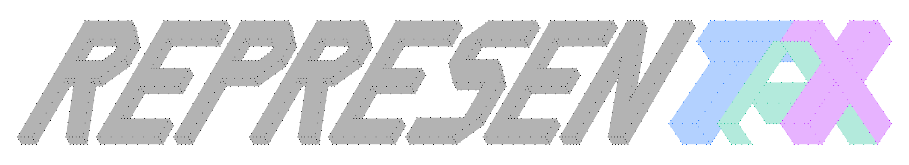

# Representax Logo

The selected logo uses the original interlocking TAX geometry with a 1.5x
left arm on the A, no added top face, uniform 30% fill and 90% edge dots.
Dots concentrate around corners and junctions, with wider spacing along long
straight edges. The gray REPRESEN prefix uses 80%-width glyphs in equal-advance
cells, preserving its height, italic angle and 3D depth. It joins the unchanged
blue/green/violet TAX mark, making the wordmark about 14% shorter overall.



## Assets

| Asset | PNG | SVG | PDF |
| --- | --- | --- | --- |
| Full wordmark | [High resolution](representax.png) | [Vector](representax.svg) | [Vector](representax.pdf) |
| Standalone mark | [3,200 px](representax-mark.png) | [Vector](representax-mark.svg) | [Vector](representax-mark.pdf) |

`representax-web.png` is the 2,400-pixel README preview. Exports have a white
background; the fill colors are precomposited tints, not transparent layers.
Use the vector PDF for print or LaTeX, and SVG for scalable web placement.
The point coordinates are retained in `representax-prefix.csv` and
`representax-mark.csv`. `manifest.json` records geometry, settings, source and
artifact hashes, package versions, and image dimensions.

## Rebuild

From the repository root, with NumPy, SciPy, Matplotlib and Pillow installed:

```sh
python docs/assets/representax/manifold/logo.py
```

This renders the selected assets directly; it does not regenerate comparison
studies. The geometry and rendering helpers are included under `manifold/`.

To run the focused logo checks, install pytest and run:

```sh
python -m pytest -q docs/assets/representax/manifold
```

The design is an homage to the JAX object and JaxPruner's sparse treatment.
It is an analytic illustration, not a learned embedding or an empirical
representation-learning result, and does not imply affiliation with those projects.
